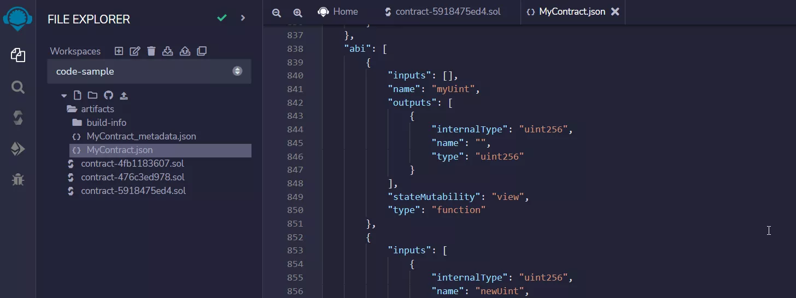

# Progress Report Solidity

# 1. Introdução
Solidity é a principal linguagem para escrever **Smart Contracts** na rede Ethereum. 

Smart Contracts são "acordos" digitais que são assinados e armazenados numa rede blockchain, onde são executados automaticamente quando os termos e condições do contrato são cumpridos.

Solidity é uma linguagem orientada a objetos e de alto nível de abstração. 

Solidity é executada sobre a **Ethereum Virtual Machine (EVM)**. A EVM é um ambiente virtual descentralizado que executa códigos ao longo de todos os nós da rede Ethereum. Os nós rodam a EVM para executar os smart contracts, usando **gas** para mensurar o esforço computacional exigido pelas operações daquele contrato.  

# 2. Solidity Básico
## 2.1 Contracts
Como foi dito acima, o Solidity é uma linguagem orientada a objetos. Porém, por se tratar de uma linguagem muito voltada ao desenvolvimento de smart contracts, os objetos em Solidity são basicamente contratos. 

Podemos definir um contrato em Solidity da seguinte forma:

```
//SPDX-License-Identifier: MIT

pragma solidity 0.8.13;

contract MyContract {
    string public myString = "Hello world";

    function updateOurString(string memory _myString) public {
        myString = _myString;
    }
}
```

Podemos ver que **contracts** são muito semelhantes às classes em linguagens orientadas à objetos. Os contratos possuem dados em formas de variáveis e funções que podem modificar essas variáveis. 

## 2.2 Tipos de Dados
Solidity possui tipagem estática, ou seja, devemos especificar qual é o tipo do dado que estamos declarando ou retornando em uma função. 

Solidity contempla os tipos de dados comuns em outas linguagens populares, como string, booleanos, etc. Porém, Solidity possui alguns outros tipos de dados não muito comuns e não possui suporte nativo para números de ponto flutuante (floats).

Em Solidity, podemos especificar o tamanho das variáveis de inteiro. 

```
//SPDX-License-Identifier: MIT

pragma solidity 0.8.14;

contract ExampleUint {
    uint256 public myUint; 

    uint8 public myUint8 = 250;

    int public myInt = -10;
}
```

A declaração dos inteiros — signed ou unsigned — pode variar de tamanho, escalando de 8 em 8 bytes (de 8 até 256). ``uint`` e ``ìnt`` são sinôminos de ``uint256`` e ``int256``, respectivamente.

Outro tipo de dado importante de destacar é o o **address**. O tipo address possui duas formas semelhantes:

- **adress:** Armazena um valor de 20 bytes (tamanho de um endereço Ethereum).
- **adress payable:** O mesmo que o address, mas também possui as variáveis de estado **transfer** e **send**.

## 2.3 View vs Pure Functions
Em Solidity podemos declarar funções com dois modificadores: 
- **View:** Uma função ``view`` é uma que lê as variáveis de estado do contrato, mas não consegue escrever sobre o estado. Um exemplo seria uma função getter.
- **Pure:** Uma função ``pure`` é uma que não lê e nem escreve sobre as variáveis de estado do contrato. Essas funções apenas conseguem acessar suas próprias variáveis e outras funções ``pure``.


Exemplos de como declarar cada uma das funções:
```
    function getMyStorageVariable() public view returns(uint) {
        return myStorageVariable;
    }

    function getAddition(uint a, uint b) public pure returns(uint) {
        return a+b;
    }
```

## 2.4 Constructor
O **constructor** é uma função especial que é chamada automaticamente durante o _deploy_ do smart contract e não pode mais ser chamada após isso. O construtor pode ser útil para inicializar as variáveis de estado do contrato durante seu _deploy_.

```
//SPDX-License-Identifier: MIT

pragma solidity 0.8.15;

contract ExampleConstructor {
    address public myAddress;

    constructor(address _someAddress) {
        myAddress = _someAddress;
    }
}
```

# 3. MetaMask
MetaMask é um software de **crypto-wallet**, ou seja, é utilizado para permitir a interação do usuário com a blockchain. A MetaMask te permite comprar, vender, e trocar ativos crypto na rede Ethereum.

Para utilizar a MetaMask, basta obter o plugin ou add-on no seu navegador e criar uma conta. Após criar a conta, a MetaMask irá te disponibilizar uma frase, chamada de **secret recovery phrase**. A secret phrase é composta por 12 palavras. Os seus fundos são conectados à essa frase e te permitem recuperá-los caso perca acesso à sua conta. Por isso, é muito importante que você guarde essa frase de maneira segura.


# 4. Solidity Intermediário
## 4.1 ``payable`` Modifier
Em Solidity podemos especificar que certa funcionalidade de um contrato irá exigir um pagamento de Eth. Fazemos isso utilizando o modificador ``payable`` na declaração de uma função. 

```
//SPDX-License-Identifier: MIT

pragma solidity 0.8.15;

contract SampleContract {
    string public myString = "Hello World";

    function updateString(string memory _newString) public payable {
        if(msg.value == 1 ether) {
            myString = _newString;
        } else {
            payable(msg.sender).transfer(msg.value);
        }
    }
}
```

O objeto ``msg`` é uma variável global que contém informações importantes sobre o smart contract e a blockchain. No código acima utilizamos esse objeto para verificar o valor de Eth enviado na transação e o endereço da conta que fez a transação.

## 4.2 Mappings
Solidity possui o tipo de dado ``mapping``. Podemos pensar nos ``mappings`` como tabelas hash, onde armazenamos os dados em pares chave-valor. A diferença entre eles é que em Solidity o valor da chave não é armazenada no mapping, mas sim o seu valor hash ``keccak256`` (um algoritmo de hasheamento).

Podemos declarar um mapping usando a seguinte sintaxe

``mapping(KeyType KeyName? => ValueType ValueName?) VariableName``

## 4.3 Structs
Solidity também contempla **structs**. Structs são utilizadas para agrupar variáveis que fazem sentido estarem juntas. Essa utilidade é bem parecida com a dos contracts, porém contracts custam **gas**, enquanto structs não. 

## 4.4 ABI Array
O **ABI (Application Binary Interface) Array** contém todas as funções, inputs, outputs e variáveis e seus tipos de um smart contract. 

O ABI fica armazenado em um arquivo JSON no projeto do seu smart contract. 

Exemplo de um ABI Array:



É importante entendermos o ABI Array pois iremos utilizá-lo nas funções da biblioteca **web3.js**.

## 4.5 Events

Eventos em Solidity nos dão uma abstração em cima da funcionalidade de _logging_ da EVM. As aplicações podem se inscrever e "escutar" esses eventos através da interface RPC (Remote Procedure Call) de um cliente Ethereum. Essa abstração nos permite armazenar e comunicar informação através da blockchain de maneira eficiente (gastando menos gas).

Exemplo de uso de eventos em Solidity:

```
//SPDX-License-Identifier: MIT
pragma solidity 0.8.16;

contract EventExample {

    mapping(address => uint) public tokenBalance;

    event TokensSent(address _from, address _to, uint _amount);

    constructor() {
        tokenBalance[msg.sender] = 100;
    }

    function sendToken(address _to, uint _amount) public returns(bool) {
        require(tokenBalance[msg.sender] >= _amount, "Not enough tokens");
        tokenBalance[msg.sender] -= _amount;
        tokenBalance[_to] += _amount;

        emit TokensSent(msg.sender, _to, _amount);

        return true;
    }
}
```

# 5. WEB3.js

``web3.js`` é uma coleção de bibliotecas JavaScript que nos permite interagir com nós da rede Ethereum usando **HTTP** ou **WebSocket**.

O ``web3.js`` possui métodos que nos permite dar deploy em smart contracts, chamar funções de smart contracts, realizar transações na rede Ethereum, etc.

Um exemplo de como podemos conectar à mainnet da Ethereum usando ``web3.js``:

``` javascript
const Web3 = require('web3');
// cria uma instância web3
const web3 = new Web3('https://mainnet.infura.io/v3/your-infura-project-id');
// verifica a conexão
web3.eth.net.isListening()
 .then(() => console.log('Connected to Ethereum'))
 .catch(error => console.error('Connection error:', error));
```

# 6. ERC20 Token
ERC20 é um padrão para criação de **tokens fungíveis** na rede Ethereum. Tokens fungíveis são aqueles que são intercambiáveis, como moedas digitais, stable coins, tokens de governança, etc.

Por definir um padrão, o ERC20 determina algumas funções obrigatórias e outras opcionais. 

Podemos ver a implementação da interface do ERC20  [aqui](https://github.com/OpenZeppelin/openzeppelin-contracts/blob/master/contracts/token/ERC20/ERC20.sol).

Podemos usar o ERC20 como um template para criar nosso próprio token ao importar e herdar do contrato base do ERC20. Um exemplo de criação e deploy de um token viável seria:

```
// SPDX-License-Identifier: MIT
pragma solidity ^0.8.4;

import "@openzeppelin/contracts/token/ERC20/ERC20.sol";
import "@openzeppelin/contracts/access/AccessControl.sol";

contract CoffeeToken is ERC20, AccessControl {
    bytes32 public constant MINTER_ROLE = keccak256("MINTER_ROLE");

    event CoffeePurchased(address indexed receiver, address indexed buyer);

    constructor() ERC20("CoffeeToken", "CFE") {
        _grantRole(DEFAULT_ADMIN_ROLE, msg.sender);
        _grantRole(MINTER_ROLE, msg.sender);
    }

    function mint(address to, uint256 amount) public onlyRole(MINTER_ROLE) {
        _mint(to, amount);
    }

    function buyOneCoffee() public {
        _burn(_msgSender(), 1);
        emit CoffeePurchased(_msgSender(), _msgSender());
    }

    function buyOneCoffeeFrom(address account) public {
        _spendAllowance(account, _msgSender(), 1);
        _burn(account, 1);
        emit CoffeePurchased(_msgSender(), account);
    }
}
```

# 7. ERC721 Token

Assim como o ERC20, o **ERC721** é outro padrão de token, porém com certas diferenças. O ERC721 representa **Non-Fungible Tokens (NFTs)**, o que significa que cada token possui um número de série único e possui uma URL para mais metadados (imagens, músicas, etc).   

## 7.1 Truffle
**Truffle** é um framework para o desenvolvimento de smart contracts na rede Ethereum. É um framework **end-to-end**, ou seja, com ele podemos construir, testar, debugar e dar deploy em smart contracts usando a Truffle CLI. 

Podemos usar ``truffle compile`` para compilar o smart contract. 

Podemos dar deploy no smart contract usando ```truffle develop`` e depois ``migrate``. Porém, o Truffle é mais interessante quando damos deploy no token em diferentes redes. Por isso, usaremos Ganache.

Para dar deploy numa rede Ganache, temos que instalá-lo, usando ``npm install -g ganache``. Depois iniciamos usando ``ganache``. Para o Truffle utilizar o Ganache, devemos especificar a rede no arquivo ``truffle-config.js`` colocando o seguinte código na seção ``networks`` do ``truffle-config.js``.

```javascript
module.exports = {
    networks: {
        ganache: {
            host: "127.0.0.1",     // Localhost (default: none)
            port: 8545,            // Standard Ethereum port (default: none)
            network_id: "*",       // Any network (default: none)
        },
    }
}
```

Para dar o deploy, usamos ``truffle migrate --network ganache``

## 7.2 Hardhat
Hardhat é muito similar ao Truffle, nos oferecendo maneiras de criar, testar e dar deploy em smart contracts na rede Ethereum.

Uma das diferenças é que no Hardhat não existe o script de migração. Para dar deploy devemos criar um script manualmente. 


